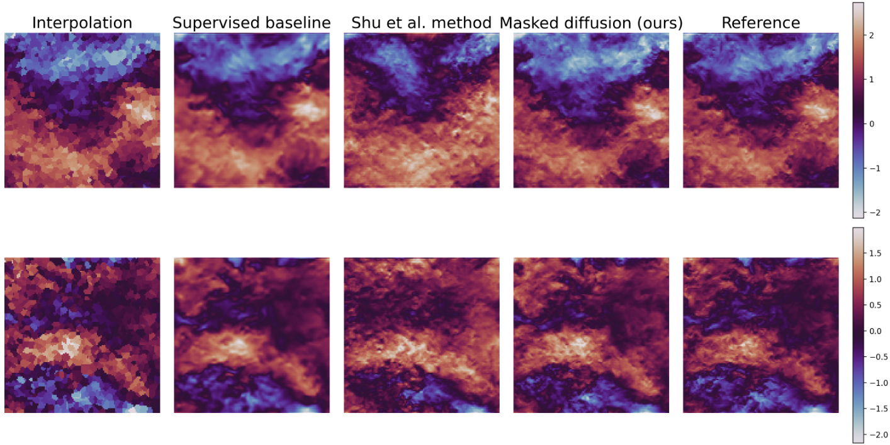

# 3D Diffusion-based sparse data reconstruction

This repository contains code for Physics Informed Generative Models for Sparse Data Reconstruction and Super-Resolution in 3D Turbulent Flows. Two test cases are considered: isotropic turbulence from the JHTDB, and a 3D channel flow.

This code is the implementation of the 3D framework presented in our article "Guiding diffusion models to reconstruct flow fields from sparse data" [arxiv](https://arxiv.org/abs/2510.19971v1).

## Data

The DNS data for the 3D isotropic turbulence test case can be downloaded from this [link](https://syncandshare.lrz.de/getlink/fi33GYfmBmqsi88p66huh2/). The file `data_spectral_128.pt` contains the original data from the isotropic turbulent dataset in the [JHTDB](https://turbulence.pha.jhu.edu/Forced_isotropic_turbulence.aspx) downscaled to resolution $128^3$ using spectral interpolation. 

The 3D channel data can be obtained directly using the solver from this [link](https://www.semanticscholar.org/paper/SIMSON-%3A-A-Pseudo-Spectral-Solver-for-Boundary-Chevalier-Schlatter/0d7e871007055441780807f8a2cd1cd243c8194e) or it is also internally available at servus06.

## Model

Everything related to the used model is inside the folder `src` using the hybrid CNN-Transformer P3D model from this [work](https://ge.in.tum.de/2025/09/16/introducing-p3d-the-3d-pde-transformer-architecture/). 

## Usage

All important scripts to train and run experiments are located in two main folder, and its main parameters are listed in cofiguration files inside the folder `configs`.

We tested many different training alternatives, which are described in the following scripts:
- `trainer_ddpm.py`: Train classical diffusion generative models.
- `trainer_fm.py`: Train classical flow matching generative models.
- `trainer_regression.py`: Train the backbone model with classical regression to learn the map from low-resolution to high-resolution.

To train a model, we select the dataset and configuration in the corresponding config file and run the `main.py` training code. Checkpoints for the model are stored in numerated runs in a separate folder.

Finally, in the folder `inference` we include some experiments to run the reconstructions shown in the paper for the isotropic turbulence case.

## Extra

The are some additional files and folders to store the runs, the generated plots, or additional code.